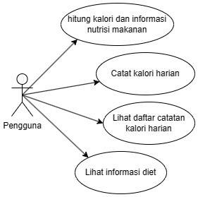
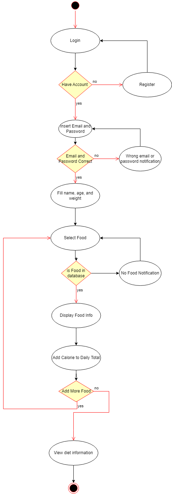
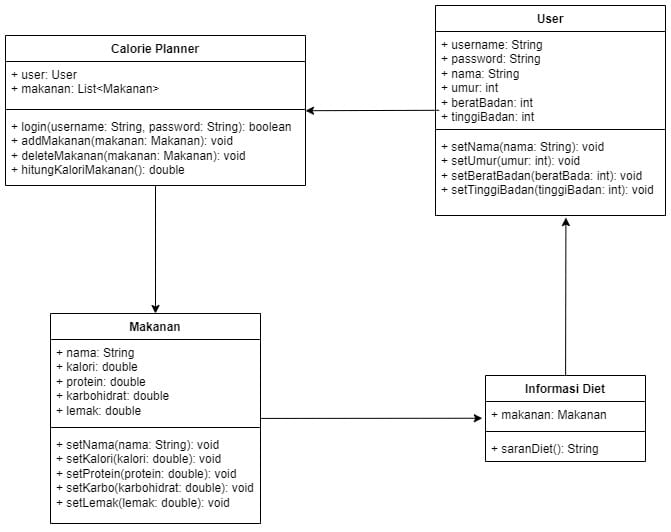
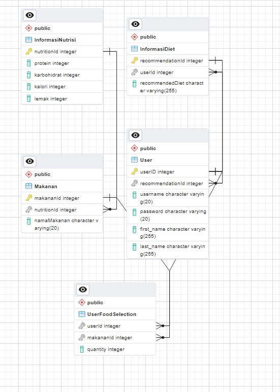

# Calorie Planner
Nama Aplikasi       : Calorie Planner
Katergori Aplikasi  : Productivity 
Tipe Aplikasi       : Windows Form

Ketua Kelompok : Nikolas Galih Saputro - 21/482747/TK/53361  
Anggota 1 : Athilla Azka Havillah - 21/474647/TK/52362  
Anggota 2 : Rico Frijaya S. Pane - 21/480631/TK/53032  
Anggota 3 : Nikolas Galih Saputro - 21/482747/TK/53361  

**PROJECT JUNIOR TEKNOLOGI INFORMASI**

**DEPARTEMEN Teknik Elektro dan Teknologi Informasi, Fakultas Teknik, Universitas Gadjah Mada**

"Calorie Planner" adalah sebuah aplikasi yang memungkinkan pengguna untuk mencatat asupan makanan harian mereka dan menghitung total kalori berdasarkan makanan yang dipilih. Aplikasi ini juga memberikan detail terkait nilai nutrisi dari makanan yang dipilih, memungkinkan pengguna untuk melihat seimbangnya nutrisi yang mereka konsumsi. Selain itu, pengguna dapat memantau dan menganalisis asupan makanan dari waktu ke waktu, serta menerima rekomendasi yang disesuaikan untuk mencapai tujuan nutrisi mereka. Dengan fokus pada pemantauan asupan makanan dan memberikan wawasan tentang nilai nutrisi, aplikasi ini membantu pengguna dalam mengelola pola makan sehat dan mencapai tujuan kesehatan atau nutrisi yang diinginkan.

**Permasalahan yang Diangkat :**

Pentingnya menjaga berat badan dan kesehatan fisik telah menjadi fokus utama bagi banyak individu. Banyak orang ingin menurunkan berat badan, membangun massa otot, atau hanya menjaga  bentuk  tubuh  yang  ideal.  Namun,  untuk  mencapai  tujuan-tujuan  tersebut, pengelolaan  asupan  kalori  sangatlah  penting.  Mengonsumsi  kalori  berlebihan  dapat menyebabkan  peningkatan  berat  badan  yang  tidak  diinginkan,  sementara mengonsumsi terlalu sedikit kalori bisa berdampak negatif pada kesehatan dan energi sehari-hari. 

**Solusi yang Diusulkan :**

Dengan adanya aplikasi "Calorie Planner", individu dapat dengan mudah melacak asupan kalori harian mereka berdasarkan jenis makanan yang mereka konsumsi. Aplikasi tersebut dapat memberikan informasi mengenai jumlah kalori, nutrisi, dan komposisi makanan secara lebih akurat. Selain itu, aplikasi ini juga bisa memberikan saran tentang pilihan makanan yang lebih sehat dan membantu pengguna dalam merencanakan pola makan yang sesuai dengan tujuan kesehatan mereka, baik itu penurunan berat badan, pemulihan setelah olahraga intensif, atau pemeliharaan umum kesehatan. 

**Aplikasi Sejenis yang Mirip dengan Solusi yang Diusulkan :**

*Calorie Calculator*

**Use Case Diagram**

**Activity Diagram**

**Class Diagram**

**Entity Relationship Diagram (ERD)**

